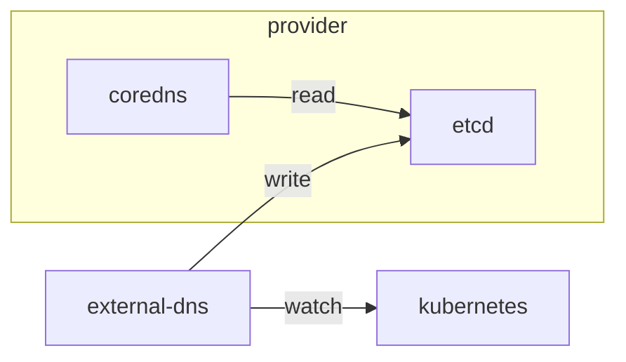

# external-dns

This example shows how to use external-dns to control DNS records dynamically
using Ingresses. A provider is represented via CoreDNS using etcd plugin.

First, create a Kubernetes cluster.

```
k3d cluster create \
    --config ./k3d-example.yaml
```

Deploy an etcd instance.

```
kubectl apply \
    --kustomize ../etcd

kubectl rollout status statefulset/etcd \
    --namespace etcd \
    --timeout 600s
```

Deploy a CoreDNS instance that reads DNS records from `example.localhost` zone
on etcd using SkyDNS format.

```
kubectl apply \
    --kustomize ./coredns

kubectl rollout status deployment/coredns \
    --namespace coredns \
    --timeout 600s
```

Now, deploy external-dns configured to watch Kubernetes `Ingress` resources,
filtered by `example.localhost` zone only, that writes DNS records on etcd using
SkyDNS format.

```
kubectl apply \
    --kustomize ./

kubectl rollout status deployment/external-dns \
    --namespace external-dns \
    --timeout 600s
```

At the end, external-dns watches Kubernetes and writes changes to etcd; CoreDNS
reads etcd on naming resolution.



## Create an Ingress

Now, create a nginx deployment with an `Ingress` configured with host
`nginx.nginx.example.localhost`.

```
kubectl apply \
    --kustomize ../nginx

kubectl rollout status deployment/nginx \
    --namespace nginx \
    --timeout 600s
```

After a few seconds, use `etcdctl` to read all values with keys prefixed
by `/external-dns`.

```
kubectl exec statefulset/etcd \
    --namespace etcd \
    --container etcd \
    -- \
        etcdctl get \
            --prefix /external-dns
```

```
/external-dns/localhost/example/nginx/a-nginx/5ffd56ea
{"text":"\"heritage=external-dns,external-dns/owner=default,external-dns/resource=ingress/nginx/nginx\"","targetstrip":1}
/external-dns/localhost/example/nginx/nginx/089ae123
{"host":"172.18.0.4","targetstrip":1}
/external-dns/localhost/example/nginx/nginx/2f6cbc75
{"host":"172.18.0.2","text":"\"heritage=external-dns,external-dns/owner=default,external-dns/resource=ingress/nginx/nginx\"","targetstrip":1}
/external-dns/localhost/example/nginx/nginx/55db8f5a
{"host":"172.18.0.3","targetstrip":1}
/external-dns/localhost/example/nginx/nginx/5ecec4c9
{"host":"172.18.0.5","targetstrip":1}
```

Create a job to execute `nslookup` and resolve `nginx.nginx.example.localhost`
using CoreDNS service.

```
kubectl create job nslookup \
    --namespace external-dns \
    --image alpine:3.20 \
    -- \
        nslookup nginx.nginx.example.localhost coredns.coredns

kubectl wait \
    --namespace external-dns \
    --for condition=complete \
    --timeout 600s \
    job/nslookup

kubectl logs job/nslookup \
    --namespace external-dns

kubectl delete job nslookup \
    --namespace external-dns
```

```
Server:		coredns.coredns
Address:	10.43.46.14:53

Name:	nginx.nginx.example.localhost
Address: 172.18.0.4
Name:	nginx.nginx.example.localhost
Address: 172.18.0.2
Name:	nginx.nginx.example.localhost
Address: 172.18.0.3
Name:	nginx.nginx.example.localhost
Address: 172.18.0.5
```

## Additional Examples

Use `etcdctl` to write a DNS record `foobar.example.localhost` that resolves to
`1.1.1.1`. After, execute `nslookup` to resolve the record on CoreDNS service.

```
kubectl exec etcd-0 \
    --namespace etcd \
    --container etcd \
    -- \
        etcdctl put /external-dns/localhost/example/foobar '{"host":"1.1.1.1","ttl":60}'

kubectl create job nslookup \
    --namespace external-dns \
    --image alpine:3.20 \
    -- \
        nslookup foobar.example.localhost coredns.coredns

kubectl wait \
    --namespace external-dns \
    --for condition=complete \
    --timeout 600s \
    job/nslookup

kubectl logs job/nslookup \
    --namespace external-dns

kubectl delete job nslookup \
    --namespace external-dns
```

```
Server:		coredns.coredns
Address:	10.43.46.14:53

Name:	foobar.example.localhost
Address: 1.1.1.1
```

## References

* [Setting up ExternalDNS for CoreDNS with minikube](https://kubernetes-sigs.github.io/external-dns/v0.14.2/tutorials/coredns)
* [CoreDNS: etcd](https://coredns.io/plugins/etcd)
* [Interacting with etcd: Read keys](https://etcd.io/docs/v3.5/dev-guide/interacting_v3/#read-keys)
* [SkyDNS](https://github.com/skynetservices/skydns)
