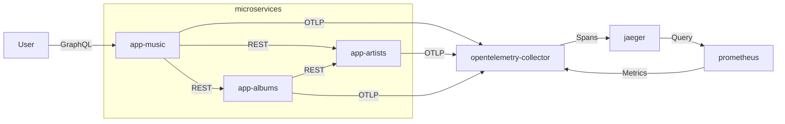

# jaeger

This example shows how to install OpenTelemetry Collector with Jaeger with
Service Performance Monitoring enabled via Prometheus. Collector receives spans
from microservices and exports metrics for Prometheus scraping.

```sh
k3d cluster create \
    --config ../k3d-example.yaml

kubectl apply \
    --filename https://github.com/cert-manager/cert-manager/releases/download/v1.8.2/cert-manager.yaml

kubectl create \
    --kustomize ../prometheus/prometheus-operator

kubectl apply \
    --kustomize ../prometheus

kubectl apply \
    --kustomize ../opentelemetry/opentelemetry-operator

kubectl apply \
    --kustomize ./jaeger-operator

kubectl apply \
    --kustomize ./
```

After, three microservices are built and applied in Kubernetes, receiving
environment variables `OTEL_EXPORTER_OTLP_ENDPOINT` with Collector endpoint and
`OTEL_SERVICE_NAME` with microservice name.

```sh
kubectl apply \
    --kustomize ../mongodb

for APPLICATION in app-music app-artists app-albums; do
    docker build "../microservices/$APPLICATION/src" \
        --tag "k3d-example-registry:5000/$APPLICATION"
    docker push "k3d-example-registry:5000/$APPLICATION"
done

kubectl apply \
    --kustomize ./app-artists

kubectl apply \
    --kustomize ./app-albums

kubectl apply \
    --kustomize ./app-music
```

Using these microservices, create a "My Artist" artist with "My Album" album and
fetch created resources from Music Application.

```sh
../microservices/create-resources.sh
```

OpenTelemetry Collector receives spans from each microservice using HTTP OTLP
Receiver and sends these spans to Jaeger. Also, Collector processes RED metrics
using Span Metrics Processor exporting for Prometheus scraping. To show these
metrics on Monitor tab, Jaeger queries metrics from Prometheus.



Tracing can be check using Jaeger UI.

```sh
kubectl port-forward service/jaeger-query http-query \
    --namespace jaeger
```


## References

* [OpenTelemetry Contrib Collector Jaeger Exporter](https://github.com/open-telemetry/opentelemetry-collector-contrib/tree/main/exporter/jaegerexporter)
* [OpenTelemetry Contrib Collector Span Metrics Processor](https://github.com/open-telemetry/opentelemetry-collector-contrib/tree/main/processor/spanmetricsprocessor)
* [OpenTelemetry Contrib Collector Prometheus Exporter](https://github.com/open-telemetry/opentelemetry-collector-contrib/tree/main/exporter/prometheusexporter)
* [Jaeger Service Performance Monitoring](https://www.jaegertracing.io/docs/1.38/spm/)
