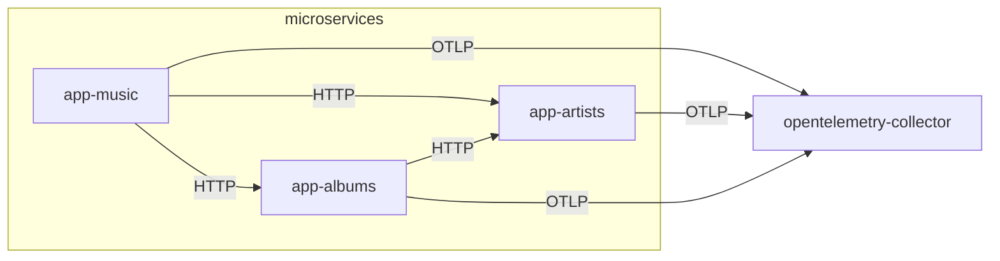

# opentelemetry

This example shows how to install OpenTelemetry Collector to receive application
spans from microservices and export its contents to standard output. Using
OpenTelemetry Operator, Collector is created and configured with HTTP OTLP
Receiver and Logging Exporter.

```sh
k3d cluster create \
    --config ../k3d-example.yaml

kubectl apply \
    --filename https://github.com/cert-manager/cert-manager/releases/download/v1.8.2/cert-manager.yaml

kubectl apply \
    --kustomize ./opentelemetry-operator

kubectl apply \
    --kustomize ./
```

After, three microservices are built and applied in Kubernetes, receiving
environment variables `OTEL_EXPORTER_OTLP_ENDPOINT` with Collector endpoint and
`OTEL_SERVICE_NAME` with microservice name.

```sh
kubectl apply \
    --kustomize ../mongodb

for APPLICATION in app-music app-artists app-albums; do
    docker build "../microservices/$APPLICATION/src" \
        --tag "k3d-example-registry:5000/$APPLICATION"
    docker push "k3d-example-registry:5000/$APPLICATION"
done

kubectl apply \
    --kustomize ./app-artists

kubectl apply \
    --kustomize ./app-albums

kubectl apply \
    --kustomize ./app-music
```



Using these microservices, create a "My Artist" artist with "My Album" album and
fetch created resources from Music Application. Each microservice will send
spans to Collector that receives them with HTTP OTLP Receiver.

```sh
../microservices/create-resources.sh
```

```json
{
  "data": {
    "artists": [
      {
        "name": "My Artist",
        "albums": [
          {
            "name": "My Album"
          }
        ]
      }
    ]
  }
}
```

Retrieve Collector logs and check spans sent by microservices on standard
output wrote by Logging Exporter.

```sh
kubectl logs deployment/opentelemetry-collector \
    --namespace opentelemetry \
    --tail 30
```

```
ScopeSpans #1
ScopeSpans SchemaURL: 
InstrumentationScope @opentelemetry/instrumentation-http 0.33.0
Span #0
    Trace ID       : 41db7e98e56c9d0b637f858f22288d48
    Parent ID      : 835b20850aceaa42
    ID             : d5881a0af2bb17ee
    Name           : HTTP GET
    Kind           : SPAN_KIND_SERVER
    Start time     : 2022-10-02 09:27:17.5641137 +0000 UTC
    End time       : 2022-10-02 09:27:17.567074 +0000 UTC
    Status code    : STATUS_CODE_UNSET
    Status message : 
Attributes:
     -> http.url: STRING(http://app-albums.app-albums.svc/v1/albums?artist._id=3f606135-af41-4eaa-9611-2d0356a1ea20)
     -> http.host: STRING(app-albums.app-albums.svc)
     -> net.host.name: STRING(app-albums.app-albums.svc)
     -> http.method: STRING(GET)
     -> http.scheme: STRING(http)
     -> http.target: STRING(/v1/albums)
     -> http.user_agent: STRING(axios/0.27.2)
     -> http.flavor: STRING(1.1)
     -> net.transport: STRING(ip_tcp)
     -> net.host.ip: STRING(10.42.1.8)
     -> net.host.port: INT(3000)
     -> net.peer.ip: STRING(10.42.1.9)
     -> net.peer.port: INT(53570)
     -> http.status_code: INT(200)
     -> http.status_text: STRING(OK)
	{"kind": "exporter", "data_type": "traces", "name": "logging"}
```

## References

* [OpenTelemetry Collector OTLP Receiver](https://github.com/open-telemetry/opentelemetry-collector/tree/main/receiver/otlpreceiver)
* [OpenTelemetry Collector Logging Exporter](https://github.com/open-telemetry/opentelemetry-collector/tree/main/exporter/loggingexporter)
* [Error Updating Container Image Version](https://github.com/open-telemetry/opentelemetry-operator/issues/1107)
* [OpenTelemetry JavaScript Client](https://github.com/open-telemetry/opentelemetry-js)
