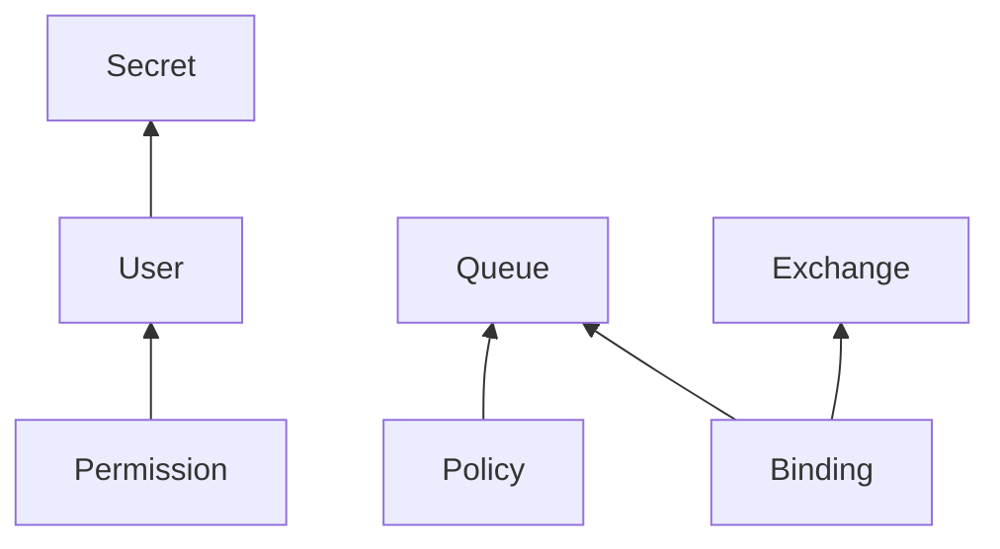

# rabbitmq

```
k3d cluster create \
    --config ../k3d-example.yaml

# RabbitMQ Cluster Kubernetes Operator
kubectl apply \
    --filename https://github.com/rabbitmq/cluster-operator/releases/download/v1.14.0/cluster-operator.yml

# Certificate Manager for Topology Operator
kubectl apply \
    --filename https://github.com/cert-manager/cert-manager/releases/download/v1.8.2/cert-manager.yaml

# RabbitMQ Messaging Topology Operator
kubectl apply \
    --filename https://github.com/rabbitmq/messaging-topology-operator/releases/download/v1.7.1/messaging-topology-operator-with-certmanager.yaml

kubectl apply \
    --kustomize .
```

## Notes

`User` resource uses `spec.importCredentialsSecret` source to initialize
`USER-user-credentials` credentials secret. When source secret is changed,
credentials secret will be not changed even if you change `User` resource
(contrary to what is written in RabbitMQ documentation). To improve reliability,
you SHOULD create `USER-user-credentials` secret with `username` and `password`
data and RabbitMQ will use it and not change it. When `USER-user-credentials`
secret changes, RabbitMQ Topology Operator will update credentials in cluster.

### Topology Dependencies



## References

* [RabbitMQ: Using Topology Operator](https://www.rabbitmq.com/kubernetes/operator/using-topology-operator.html)
