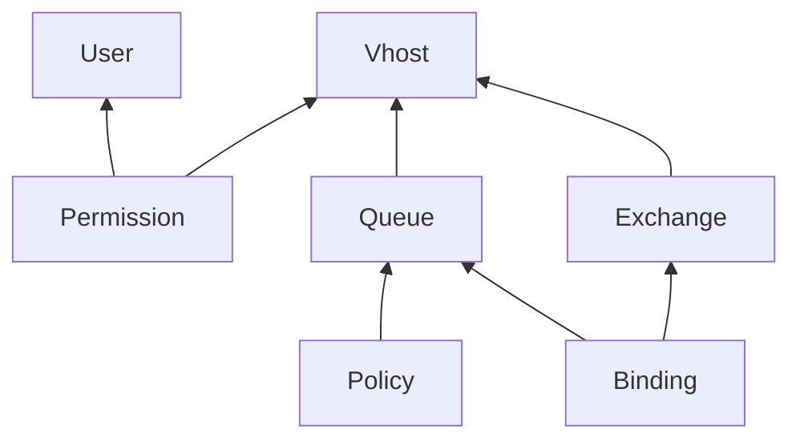

# rabbitmq

```
k3d cluster create \
    --config ../k3d-example.yaml

k3d node create example-agent-rabbitmq \
    --cluster example \
    --replicas 3 \
    --memory 1G \
    --role agent \
    --k3s-node-label node.kubernetes.io/agent=rabbitmq \
    --wait

# RabbitMQ Cluster Kubernetes Operator
kubectl apply \
    --filename https://github.com/rabbitmq/cluster-operator/releases/download/v1.14.0/cluster-operator.yml

# Certificate Manager for Topology Operator
kubectl apply \
    --filename https://github.com/cert-manager/cert-manager/releases/download/v1.8.2/cert-manager.yaml

# RabbitMQ Messaging Topology Operator
kubectl apply \
    --filename https://github.com/rabbitmq/messaging-topology-operator/releases/download/v1.7.1/messaging-topology-operator-with-certmanager.yaml

kubectl apply \
    --kustomize .
```

## Notes

If `USER-user-credentials` exists, `User` resource will be not created and
Kubernetes does not show error messages.

### Topology Dependencies



## References

* [RabbitMQ: Using Topology Operator](https://www.rabbitmq.com/kubernetes/operator/using-topology-operator.html)
