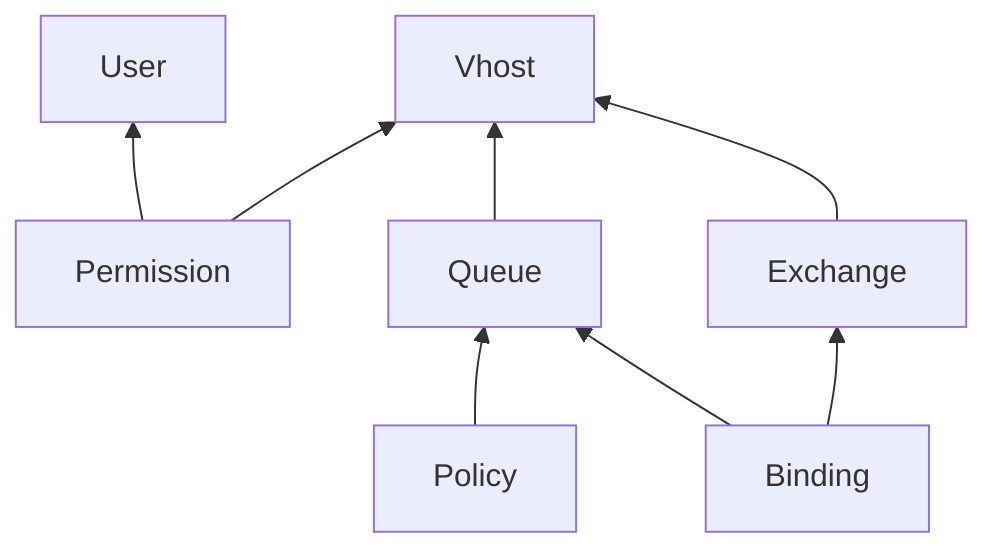

# rabbitmq

This example shows how to deploy a RabbitMQ Cluster via Cluster Operator, adding
three separate Kubernetes nodes to deploy the RabbitMQ using taints and
affinity.

Also, it installs and shows how to use Topology Operator to provision RabbitMQ
Cluster resources using Kubernetes CRD. Cert Manager is installed too, because
Topology Operator depends on it.

```
k3d cluster create \
    --config ../k3d-example.yaml \
    && sleep 2 \
    && k3d node create example-agent-rabbitmq \
        --cluster example \
        --replicas 3 \
        --memory 1G \
        --role agent \
        --k3s-arg --node-taint=node.kubernetes.io/broker=rabbitmq:NoSchedule

# RabbitMQ Cluster Kubernetes Operator
kubectl apply \
    --filename https://github.com/rabbitmq/cluster-operator/releases/download/v1.14.0/cluster-operator.yml

# Certificate Manager for Topology Operator
kubectl apply \
    --filename https://github.com/cert-manager/cert-manager/releases/download/v1.8.2/cert-manager.yaml

# RabbitMQ Messaging Topology Operator
kubectl apply \
    --filename https://github.com/rabbitmq/messaging-topology-operator/releases/download/v1.7.1/messaging-topology-operator-with-certmanager.yaml
```

## Producer-Consumer Example

Two projects were developed to show how to use Topology Operator, using a
producer-consumer pattern to calculate the factorial of a number.

`app-factorial-api` is a REST API that provides two endpoints: one receives a
number and responds with a new location and another corresponds to this new
location to retrieve the factorial of number. API produces messages on RabbitMQ
to async execution and retrieves results calculated on bucket. This example uses
MinIO as bucket provider.

`app-factorial-worker` is a worker consumer from RabbitMQ that computes
factorial of number and stores its results on bucket.

Use Docker to build and push these container images to cluster registry.

```
docker build ./src/app-factorial-api \
    --tag k3d-example-registry:5000/app-factorial-api

docker push k3d-example-registry:5000/app-factorial-api

docker build ./src/app-factorial-worker \
    --tag k3d-example-registry:5000/app-factorial-worker

docker push k3d-example-registry:5000/app-factorial-worker
```

## Deployment

Resources are available using Kustomize and must be applied using this command.

```
kubectl apply \
    --kustomize .
```

## Testing

This snipped shows how to calculate the factorial of 10.

```
./src/app-factorial-api/factorial.sh 10
```

## Notes

If `USER-user-credentials` exists, `User` resource will be not created and
Kubernetes does not show error messages.

### Topology Dependencies



## References

* [RabbitMQ: Using Topology Operator](https://www.rabbitmq.com/kubernetes/operator/using-topology-operator.html)
