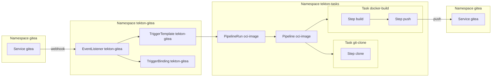

# tekton

```
k3d cluster create \
    --config ../k3d-example.yaml
```

```
helm dependency build ../gitea

helm install gitea ../gitea \
    --namespace gitea \
    --create-namespace
```

```
kubectl apply \
  --filename https://storage.googleapis.com/tekton-releases/pipeline/previous/v0.45.0/release.yaml

kubectl apply \
  --filename https://storage.googleapis.com/tekton-releases/triggers/previous/v0.22.2/release.yaml

kubectl apply \
  --filename https://storage.googleapis.com/tekton-releases/triggers/previous/v0.22.2/interceptors.yaml
```



```
kubectl apply \
    --kustomize ./gitea

kubectl apply \
    --filename ./gitea/taskrun-gitea-org-foobar.yaml

kubectl apply \
    --filename ./gitea/taskrun-gitea-repo-app.yaml
```

```
kubectl apply \
    --kustomize ./tekton-tasks

kubectl apply \
    --kustomize ./tekton-gitea
```
